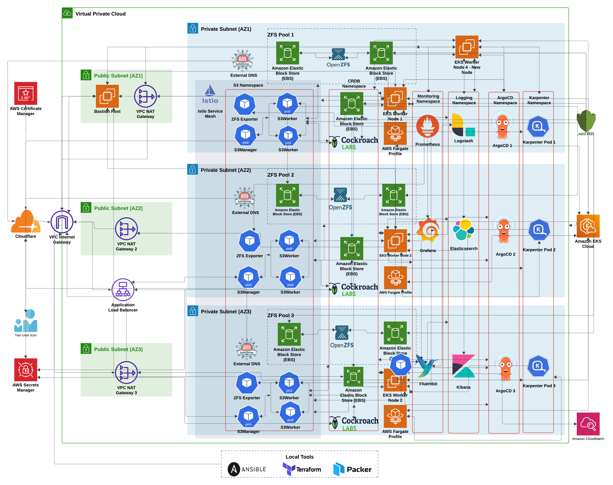

**<h2>FileFlux: Secure, Scalable, and Effortless File Storage and Management </h2>**

FileFlux is a highly scalable and secure file storage and management platform hosted on AWS and orchestrated via Kubernetes (EKS). It allows users to register, create/delete buckets, and upload/download/manage files with high availability and efficient storage mechanisms like ZFS pools. The application is built to handle large-scale file operations and is optimized for performance, security, and fault tolerance.

## Features
- File Operations: Supports uploading, downloading, and managing files (GET/PUT/HEAD/DELETE operations)
- Bucket Management: Create/delete buckets and manage storage
- Account Management: Register and manage user accounts
- Highly Available & Scalable: Built on Amazon EKS, with Kubernetes-based microservices architecture and autoscaling using Karpenter
- Efficient Storage: Uses ZFS pools to provide scalable and reliable file storage, with custom ZFS pool management via Ansible and automatic EBS volume provisioning
- Advanced Monitoring and Logging: Integrated monitoring (Prometheus, Grafana) and logging (Fluent Bit, Elasticsearch, Kibana) for real-time metrics and log processing
- Secure and Resilient: Uses AWS services like Secrets Manager, ACM, KMS, CloudWatch, and CockroachDB for enhanced security and redundancy
- Service Mesh & Traffic Management: Leverages Istio for secure service communication and blue-green deployment strategies
- Automated Infrastructure: The entire infrastructure is provisioned via Terraform, Helm, Ansible, and ArgoCD for continuous deployment

## Infrastructure
The FileFlux infrastructure is provisioned using Terraform and other tools to set up a secure and scalable Amazon EKS (Elastic Kubernetes Service) cluster on AWS. Key components include:

### Network and Security
VPC with 3 public and 3 private subnets across 3 availability zones for redundancy. 
NAT Gateways for private subnet internet access and an Internet Gateway for public subnets. 
Security Groups and IAM policies/roles to manage access control for EKS worker nodes, bastion hosts, and other AWS services like KMS, CloudWatch, Route53, etc.  
Bastion Host for secure SSH access to private EKS worker nodes. 
Automated validation, issuance, and renewal via AWS Certificate Manager (ACM) and Cloudflare. 

### Compute and Storage
EKS Cluster (Kubernetes v1.30) with add-ons like Secrets Store CSI Driver, EBS CSI Driver, VPC-CNI, and Kube-proxy. 
Fargate profile is initially used to provision the Karpenter workload for autoscaling. 
Self-Managed Worker Nodes: EKS worker nodes based on a custom Ubuntu 22.04 AMI with ZFS file system.  
Karpenter: It is used to deploy self-managed EKS worker nodes based on workload demand using Spot and On-Demand EC2 instances. 
ZFS Pools: Scalable storage solution deployed using EBS volumes, encrypted via KMS, and automatically managed with Ansible for ZFS pool expansion. 

### Monitoring and Logging
Prometheus: Monitors the cluster and FileFlux application performance with custom metrics like the number of GET, PUT, DELETE requests. 
Grafana: Custom dashboards display ZFS pool info (total size, available space, health) and application performance. 
Fluent Bit: Collects logs and forwards them to CloudWatch and Logstash, backed by Elasticsearch for log management and visualization via Kibana. 
External DNS: Integrated with Cloudflare to automatically manage DNS records for the FileFlux app. 

### Database and Secrets Management
CockroachDB: A highly available, distributed database for storing application metadata, such as bucket names, file paths, node information, users, zfs pools, and more. Deployed and managed via Helm and ArgoCD. 
AWS Secrets Manager: Integrated with Kubernetes to manage secrets for various microservices, ensuring sensitive information like database credentials are securely stored. 

### GitOps and Continuous Deployment
ArgoCD: Manages continuous delivery and deployment of Helm charts and Kubernetes manifests, ensuring automated and version-controlled deployments of microservices. 
Istio: Implements service mesh for mTLS, traffic management, and blue-green deployments. Traffic routing between different versions of the application is controlled using Istio VirtualService and DestinationRules. 

## Microservices Architecture
### Manager Web Application
Manager is a Python Flask-based web application responsible for receiving, processing, and forwarding file operations (like upload and download) to the Worker Web Application.
Interacts with CockroachDB to store file metadata (bucket names, paths, etc.) and forwards the actual file operations to the Worker Pods.

### Worker Web Application
Worker handles the actual processing and storage of files. It saves file data to ZFS Pools and interacts with CockroachDB to ensure metadata is properly stored and managed.

### ZFS Exporter Web Application
Exposes metrics about ZFS Pools (such as total size, available space, pool health) to Prometheus for monitoring.

### Heartbeat Web Application
Monitors the health of EKS Worker Nodes by receiving and processing heartbeat signals, ensuring worker nodes and ZFS pools are available and operational.

## Deployment and Automation
### Infrastructure Setup:
Infrastructure is provisioned using Terraform. This includes creating VPCs, subnets, security groups, IAM roles, and setting up the EKS cluster with custom configurations like the Secrets Store CSI Driver, VPC-CNI, and EBS CSI Driver.
Fargate profile is temporarily used for Karpenter setup, after which self-managed EKS worker nodes are launched using a custom AMI with ZFS file system.

### Continuous Delivery:
ArgoCD automates the deployment of the FileFlux components, such as CockroachDB, Manager, and Worker Web Applications using Helm charts.
Karpenter handles the autoscaling of worker nodes dynamically based on demand.

### Storage Management:
ZFS is used as the file system on the worker nodes, providing scalable and reliable storage for file operations. ZFS pools are automatically managed using Ansible playbooks, which handle EBS volume expansion and pool resizing.

### Monitoring & Logging:
Prometheus monitors cluster health, ZFS pool metrics, and application performance.
Logs from the application and worker nodes are collected using Fluent Bit and sent to CloudWatch and ELK stack for processing and visualization.

### Security:
KMS encrypts sensitive data stored on EBS volumes used by worker nodes.
AWS Secrets Manager integrates with Kubernetes to manage and sync secrets for various microservices.

### ZFS Advantages
Scalability: Supports dynamic expansion as new EBS volumes are added, allowing the ZFS pool to grow with demand. 
Reliability: Provides high data integrity with features like copy-on-write and automatic repair. 
Efficient Storage: ZFS ensures efficient use of storage through advanced compression and deduplication. 
Snapshots and Clones: Enables efficient backups and restores with ZFS snapshots and clones. 

## Repositories
### 1. [Infra](https://github.com/fileflux/infra)
This repository contains Terraform and other necessary code to set up a highly available and scalable Amazon EKS (Elastic Kubernetes Service) cluster and its associated infrastructure components on AWS to host the various microservices that make up the FileFlux application.

### 2. [Helm Manager](https://github.com/fileflux/helm-manager)
This is a Helm chart for deploying FileFlux Manager on a Kubernetes cluster

### 3. [Helm Worker](https://github.com/fileflux/helm-worker)
This is a Helm chart for deploying FileFlux Worker on a Kubernetes cluster

### 4. [Helm CockroachDB](https://github.com/fileflux/helm-cockroachdb) 
This is a Helm chart for deploying CockroachDB on a Kubernetes cluster with custom configurations for FileFlux

### 5. [Ansible](https://github.com/fileflux/ansible)
This project contains Ansible playbooks to automate the management of ZFS pools and EBS volumes associated with the self-managed AWS EKS worker nodes. The playbooks handle tasks such as discovering EC2 instances based on tags, connecting through a bastion host, and running scripts on the EKS worker node to create new EBS volumes, attaching it to the appropriate worker node, adding it to the ZFS pool, and resizing the ZFS pool. 

### 6. [AMI](https://github.com/fileflux/ami)
This project builds an Amazon Machine Image (AMI) using Packer. Packer automates the creation of machine images across multiple platforms, enabling consistent and reproducible AMIs for deployment on AWS.

### 7. [Webapp Manager](https://github.com/fileflux/manager-webapp)
This is a main Python Flask-based web application designed receive, process and save files from the end users. The application is designed to be deployed in a Kubernetes cluster and uses a CockroachDB Cluster as the backend database for storing information and uses ZFS pools across various Kubernetes worker nodes to store the end-user files.

### 8. [Webapp Worker](https://github.com/fileflux/worker-webapp)
This is a backend Python Flask-based web application designed receive, process and save files from the end users. The application is designed to be deployed in a Kubernetes cluster and uses a CockroachDB Cluster as the backend database for storing information and uses ZFS pools across various Kubernetes worker nodes to store the end-user files. 

### 9. [ZFS Exporter Webapp](https://github.com/fileflux/zfs-exporter-webapp)
This is a Python-based web application designed to expose ZFS pool metrics for Prometheus scraping. It gathers ZFS pool information, such as total capacity, available space, and pool status, so that Promethus can scrape this information and display it via Grafana. The app uses zfsutils-linux to interact with the ZFS pools and is designed for easy deployment via Docker.

### 10. [Heartbeat Webapp](https://github.com/fileflux/heartbeat-webapp)
This is a Python Flask-based web application designed to receive heartbeat signals from EKS nodes. It stores and updates information about the worker node name, worker node availability, total ZFS pool size, and available space in the ZFS pool in a CockroachDB cluster. The app provides an endpoint to handle heartbeat signals from the EKS nodes, ensuring that the system can monitor worker node health and performance in real-time.

### 11. [Istio](https://github.com/fileflux/istio_bluegreen)
This repository contains code that demonstrates a blue-green deployment strategy using Istio for traffic management. 